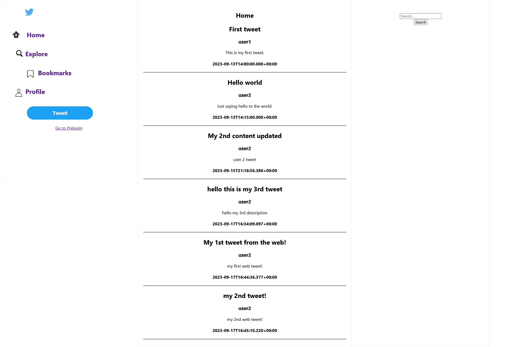
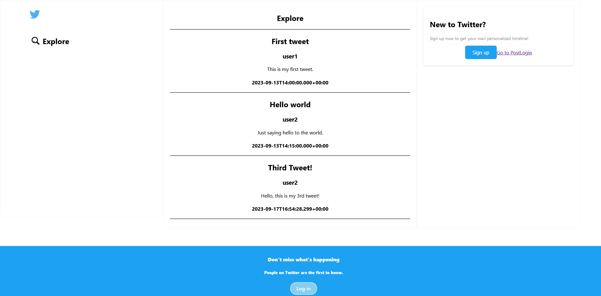
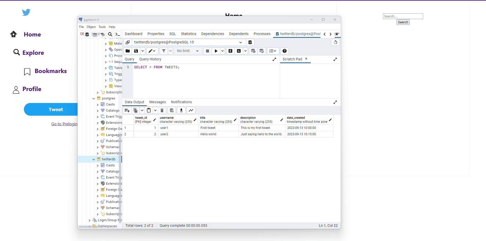

## Twitter Clone
### A project that aims to be a clone of twitter, using React for the front end, Java Spring boot for the backend, and PostgreSQL for the database.

### Currently has the functionality to create a tweet, and show tweets posted

## Functionality

### Home Page


### Explore page


### Make a tweet


## To run
### Setup the backend
https://github.com/ShashiSugrim/TwitterBackend

### Backend should be running before you get to this step. In a seperate terminal, install and run this project

```
npm install
npm start
```